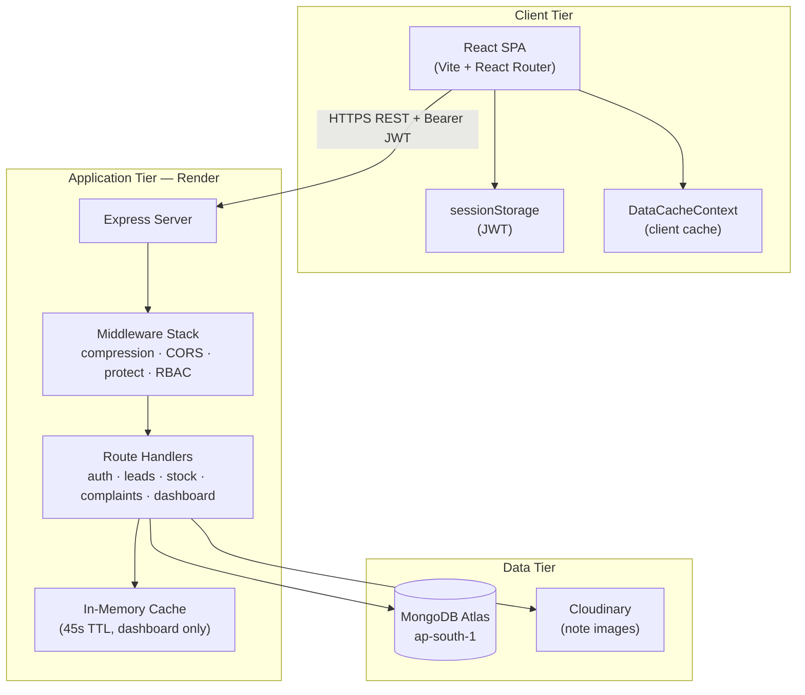
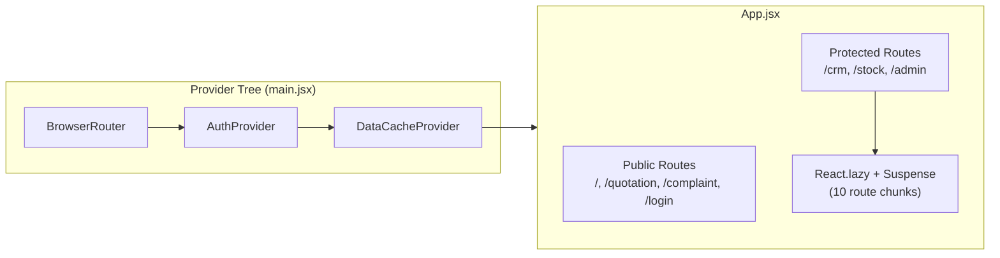
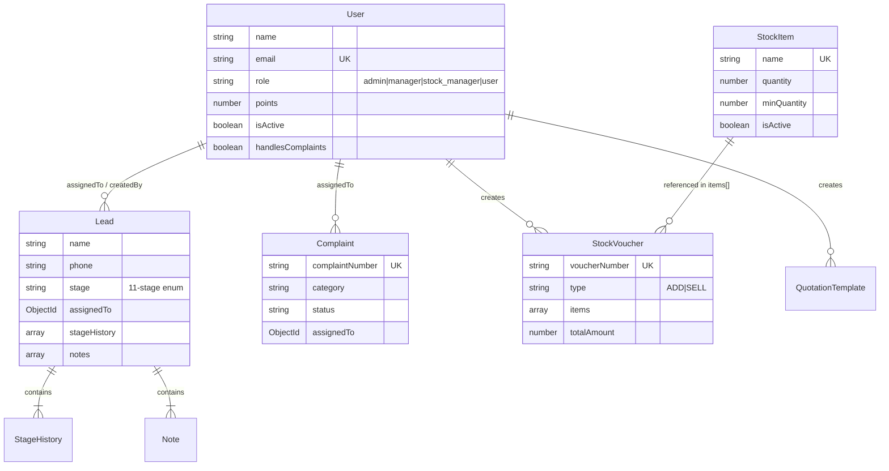
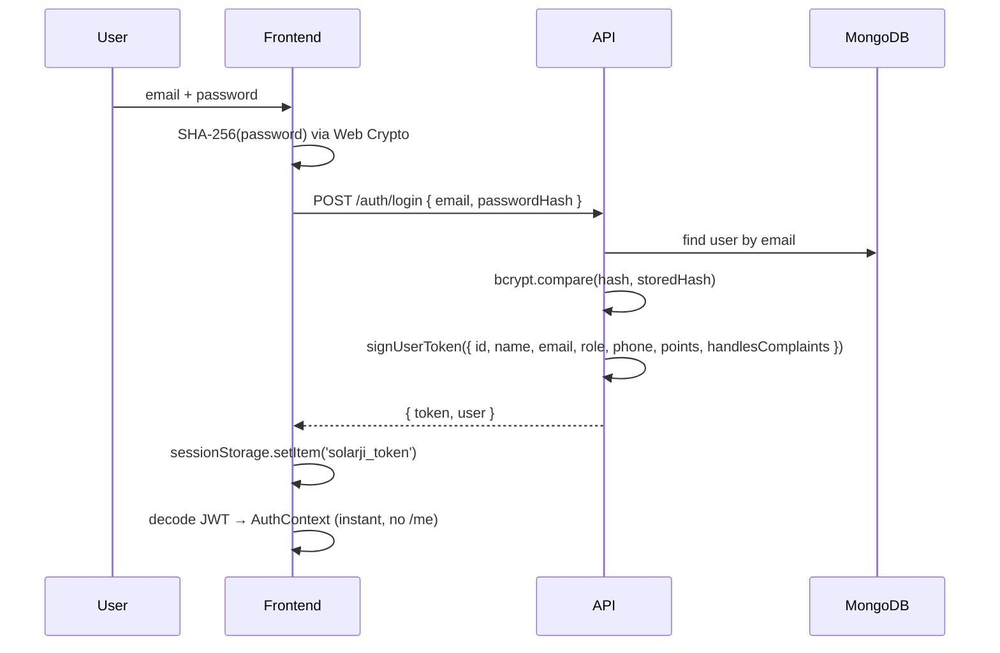

# SolarJi

**Enterprise operations platform for solar installation businesses.**

SolarJi unifies CRM, inventory control, team management, and sales analytics into a single web application. It is designed for teams that manage long, compliance-heavy project pipelines—site surveys, loan filing, KESCO processes, meter installation—and need inventory tied to those projects without maintaining separate spreadsheets.

| | |
|---|---|
| **Production API** | `https://solarji.onrender.com/api` |
| **Architecture** | Layered monolith — React SPA + Express REST API + MongoDB |
| **Auth model** | Stateless JWT with embedded claims; tab-scoped session storage |
| **Deep docs** | [`docs/ARCHITECTURE.md`](docs/ARCHITECTURE.md) · [`docs/PROJECT_HISTORY.md`](docs/PROJECT_HISTORY.md) |

---

## Table of Contents

- [Executive Summary](#executive-summary)
- [Roles & Access Control](#roles--access-control)
- [System Architecture](#system-architecture)
- [Domain Model](#domain-model)
- [Application Modules](#application-modules)
- [Authentication & Authorization](#authentication--authorization)
- [Data Flow](#data-flow)
- [Caching & Performance](#caching--performance)
- [API Design](#api-design)
- [Security Model](#security-model)
- [Technology Stack](#technology-stack)
- [Repository Layout](#repository-layout)
- [Getting Started](#getting-started)
- [Configuration Reference](#configuration-reference)
- [Deployment & Operations](#deployment--operations)
- [Development Conventions](#development-conventions)
- [Further Reading](#further-reading)

---

## Executive Summary

SolarJi addresses four operational problems common in solar businesses:

1. **Pipeline visibility** — Leads move through eleven industry-specific stages. Every transition is logged with actor, timestamp, and optional notes.
2. **Inventory integrity** — Stock changes only through formal purchase (ADD) or sales (SELL) vouchers. Quantities are updated atomically; voucher deletion reverses the transaction.
3. **Sales accountability** — A points system rewards fast stage progression (`5 − days elapsed`), surfaced on a team leaderboard.
4. **After-sales support** — Customers register service complaints from the public website; admins assign them to employees who have been granted complaint access.

The system supports four roles—**Admin**, **Stock Manager**, **Manager**, and **Employee**—with enforced access at both the API middleware layer and the frontend route layer.

| Role | DB value | Login redirect |
|------|----------|----------------|
| Admin | `admin` | `/admin` |
| Stock Manager | `stock_manager` | `/stock` |
| Manager | `manager` | `/crm` |
| Employee | `user` | `/crm` |

---

## Roles & Access Control

SolarJi uses **role-based access control (RBAC)** on the backend (middleware + query filters) and frontend (routes + conditional UI).

### Role Summary

| Role | Purpose |
|------|---------|
| **Employee** | Field sales — works only on leads assigned to them |
| **Manager** | Sales lead — all leads, view team, move leads through stages, assign employees |
| **Stock Manager** | Inventory oversight — all Manager access, plus stock module (purchase/sale vouchers) |
| **Admin** | Full control — all CRUD, delete leads, reset reward points, add inventory items |

### CRM & Leads

| Capability | Employee | Manager | Stock Manager | Admin |
|:-----------|:--------:|:-------:|:-------------:|:-----:|
| View own assigned leads | ✓ | ✓ | ✓ | ✓ |
| View **all** leads | — | ✓ | ✓ | ✓ |
| Create / edit leads | ✓ | ✓ | ✓ | ✓ |
| **Move stage / forward pipeline** | ✓* | ✓ | ✓ | ✓ |
| Assign / reassign leads | — | ✓ | ✓ | ✓ |
| Add notes & images | ✓ | ✓ | ✓ | ✓ |
| Delete leads (single / bulk) | — | — | — | ✓ |

\*Employee can move stages on leads assigned to them.

### Team & Administration

| Capability | Employee | Manager | Stock Manager | Admin |
|:-----------|:--------:|:-------:|:-------------:|:-----:|
| View team (read-only) | — | ✓ | ✓ | ✓ |
| User management (CRUD) | — | — | — | ✓ |
| Reset reward points | — | — | — | ✓ |
| Admin dashboard | — | — | — | ✓ |
| Quotation template CRUD | — | — | — | ✓ |

### Inventory & Stock

| Capability | Employee | Manager | Stock Manager | Admin |
|:-----------|:--------:|:-------:|:-------------:|:-----:|
| Access stock module | — | — | ✓ | ✓ |
| View inventory items | — | — | ✓ | ✓ |
| **Add / edit / deactivate items** | — | — | — | ✓ |
| **Purchase voucher (ADD)** | — | — | ✓ | ✓ |
| **Sales voucher (SELL)** | — | — | ✓ | ✓ |
| Delete vouchers | — | — | ✓ | ✓ |

> **Inventory rule:** Only **Admin** adds or edits items in the master catalog. **Stock Manager** and **Admin** record purchase and sale transactions via vouchers, which update quantities automatically.

### Service Complaints

Complaints are submitted via the **public** form at `/complaint` (no login). New complaints are created **unassigned**; the admin assigns them in the CRM inbox.

| Capability | Employee* | Manager | Stock Manager | Admin |
|:-----------|:---------:|:-------:|:-------------:|:-----:|
| Public complaint form (`/complaint`) | ✓ (public) | ✓ | ✓ | ✓ |
| Complaints inbox (`/crm/complaints`) | ✓* | — | — | ✓ |
| View **all** complaints | — | — | — | ✓ |
| View complaints **assigned to self** | ✓* | — | — | — |
| Assign / reassign complaints | — | — | — | ✓ |
| Enable complaint access for employees | — | — | — | ✓ |

\*Employee must have **Service complaints access** (`handlesComplaints: true`) enabled by admin in User Management. After toggling, the employee must **log out and back in** so the JWT picks up the flag.

> **Routing rule:** There is no env-based default assignee. Admin chooses which employee handles each complaint from the complaints dashboard.

### Backend Middleware

| Middleware | Allowed roles |
|------------|---------------|
| `teamViewAccess` | Manager, Stock Manager, Admin |
| `stockAccess` | Stock Manager, Admin |
| `stockTransact` | Stock Manager, Admin |
| `stockItemManage` | Admin only |
| `adminOnly` | Admin only |
| `complaintsAccess` | Admin or `handlesComplaints` |
| `canManageAllComplaints()` | Admin only (all complaints + assign) |
| `buildLeadFilter()` | Employees scoped to `assignedTo = self` |

### Frontend Routes

| Route | Employee | Manager | Stock Mgr | Admin |
|:------|:--------:|:-------:|:---------:|:-----:|
| `/crm/*` | ✓ | ✓ | ✓ | ✓ |
| `/crm/team` | — | ✓ | ✓ | ✓ |
| `/crm/users` | — | — | — | ✓ |
| `/crm/complaints` | ✓* | — | — | ✓ |
| `/stock/*` | — | — | ✓ | ✓ |
| `/admin` | — | — | — | ✓ |
| `/complaint` | Public (no login) | | | |

**Migration note:** If accounts were previously `manager` for inventory staff, reassign them to `stock_manager` in User Management. The `manager` role is now **Sales Manager** (CRM only).

---

## System Architecture

### High-Level Topology

SolarJi follows a **classic three-tier, stateless API architecture**. The backend holds no session state; identity travels in signed JWTs. Dashboard statistics use a short-lived in-process cache to reduce database load without introducing external dependencies (Redis).



### Architectural Principles

| Principle | Implementation |
|-----------|----------------|
| **Stateless API** | JWT carries user identity and role; no server-side session store |
| **Defense in depth** | RBAC enforced in middleware *and* query filters (e.g. lead scoping) |
| **Bounded payloads** | Server-side pagination on all list endpoints (default 20, max 100) |
| **Write-through invalidation** | Mutations invalidate relevant dashboard and list caches immediately |
| **Separation of concerns** | Models define schema; routes orchestrate; utils hold reusable logic |
| **Progressive loading** | CRM, stock, and admin routes are code-split via `React.lazy()` |

### Request Pipeline (Backend)

Every `/api/*` request passes through a fixed middleware chain before reaching route handlers:

```
Incoming Request
  │
  ├─► compression()          gzip response bodies
  ├─► cors()                 origin allowlist + 24h preflight cache
  ├─► express.json()         body parsing
  ├─► Cache-Control: no-store  prevent browser caching of API responses
  │
  ├─► protect                verify JWT; hydrate req.user from claims (no DB)
  ├─► adminOnly / stockAccess   role gate (where applicable)
  │
  └─► Route Handler          business logic → JSON response
                               (optional: refreshed token in body)
```

The `protect` middleware implements a **fast path**: tokens issued after the optimization phase embed `{ id, name, email, role, phone, points }` directly in the JWT payload. Legacy tokens containing only `id` trigger a single database lookup until the user re-authenticates.

### Frontend Composition



**AuthProvider** bootstraps the UI by decoding the JWT from `sessionStorage`—no round-trip to `/auth/me` on every page load. **DataCacheProvider** deduplicates in-flight requests and holds session-scoped caches for dashboards, paginated lead pages, and assignee dropdowns.

---

## Domain Model

Six MongoDB collections form the persistence layer. Indexes are declared on schemas and synchronized at connection time via `syncIndexes()`.



### Lead Pipeline Stages

```
Lead → Calling → Visit → Filing → Loan Filing → Loan Process
  → Installation → Kesco Filing → Kesco Process → Meter Install → Commission
```

Stage transitions append to `stageHistory[]` and may award points to the assigned user.

### Stock Transaction Model

| Voucher Type | Prefix | Quantity Effect | Use Case |
|:-------------|:-------|:----------------|:---------|
| `ADD` | `PV-00001` | Increases stock | Purchase from supplier |
| `SELL` | `SV-00001` | Decreases stock | Material issued for installation |

Voucher creation and deletion both use **batch item lookup + `bulkWrite()`** to avoid N+1 query patterns.

---

## Application Modules

### CRM (`/crm/*`)

| Surface | Responsibility |
|---------|----------------|
| Dashboard | Pipeline breakdown, recent leads, leaderboard — served by `/api/dashboard/crm` |
| Leads | Paginated list, `$text` search, stage filter, bulk delete (admin) |
| Lead Detail | Stage changes, assignment, notes with image upload |
| New Lead | Creation with assignee picker |
| Users | Admin-only paginated user management; **Service complaints access** toggle |
| Complaints | Admin: all complaints + assign; employees: assigned only |

### Stock (`/stock/*`)

| Surface | Responsibility |
|---------|----------------|
| Dashboard | Inventory value, low-stock alerts, recent vouchers |
| Items | Paginated CRUD; print report fetches on demand |
| Vouchers | Paginated history with purchase/sales totals |
| Voucher Form | Picker API (`?picker=1`) loads minimal item fields |

Accessible to **Admin** and **Stock Manager** only.

### Admin (`/admin`)

Cross-module overview: user counts, quotation templates, quick link to complaints inbox. Admin role only.

### Public (`/`, `/quotation`, `/complaint`)

Marketing landing page, client-facing quotation generator, and **Register Complaint** form (23 issue categories, SMTP confirmation email). No authentication required.

---

## Authentication & Authorization

### Login Sequence



Passwords are **never transmitted in plain text**. The client hashes with SHA-256; the server stores `bcrypt(SHA-256(password), 12 rounds)`.

See [Roles & Access Control](#roles--access-control) for the full permission matrix.

### Token Lifecycle

- **Expiry:** 7 days
- **Storage:** `sessionStorage` (cleared when tab closes)
- **Refresh:** Mutating endpoints (stage change, points reset) return a fresh `token` in the response body; the Axios interceptor applies it automatically
- **Legacy migration:** One-time promotion from older `localStorage` keys

---

## Data Flow

### Typical CRM Session

```
1. User opens /crm
2. AuthProvider decodes JWT locally          → 0ms network
3. CRMDashboard mounts
4. fetchDashboardCrm()
   ├─ cache hit (client)                      → render immediately
   └─ cache miss → GET /dashboard/crm
      ├─ server cache hit (45s)               → ~50ms
      └─ server cache miss → aggregation      → ~200ms (region-dependent)
5. User navigates to /crm/leads?page=2
6. fetchLeadsPage({ page: 2 })               → GET /leads?page=2&limit=20
7. User changes stage on lead detail
8. PUT /leads/:id/stage                      → points updated, new token returned
9. Dashboard + lead caches invalidated
```

### Stock Voucher Write Path

```
POST /stock/vouchers
  → loadStockItemMap(itemIds)        single batch query
  → applyVoucherRowChange() × N      in-memory delta calculation
  → validate no negative stock
  → StockItem.bulkWrite()            single write operation
  → StockVoucher.create()
  → invalidateStock() + invalidateAdmin()
```

---

## Caching & Performance

SolarJi uses a **deliberately layered cache strategy**—no background prefetch; caches activate on user navigation and invalidate on writes.

| Layer | Scope | TTL | Invalidation |
|-------|-------|-----|--------------|
| JWT claims | Per request | 7 days | Token refresh on mutation |
| Server dashboard cache | In-process Map | 45s | Prefix invalidation on writes |
| Client dashboard cache | DataCacheContext | Session | `invalidateDashboard*` |
| Client leads page cache | DataCacheContext | Session | `invalidateLeadsPages` |
| In-flight deduplication | DataCacheContext | Request | Automatic |

### Key Optimizations

| Area | Technique | Rationale |
|------|-----------|-----------|
| Auth | Embedded JWT claims | Eliminates DB round-trip on every API call |
| Bootstrap | Client-side JWT decode | Removes mandatory `/auth/me` on load |
| Lists | Server pagination + text index | O(page size) instead of O(collection size) |
| Stock | `bulkWrite` for vouchers | Replaced per-item update loops (N+1) |
| Network | gzip + CORS preflight cache | Smaller payloads; fewer OPTIONS requests |
| Bundle | Route-level code splitting | Faster first contentful paint |
| Images | Sharp → WebP before Cloudinary | Reduced storage and transfer cost |

Full optimization history: [`docs/PROJECT_HISTORY.md`](docs/PROJECT_HISTORY.md)

---

## API Design

RESTful JSON over HTTPS. All protected endpoints require:

```http
Authorization: Bearer <JWT>
```

### Endpoint Map

| Module | Prefix | Notable Endpoints |
|--------|--------|-------------------|
| Auth | `/api/auth` | `POST /login`, `GET /me`, `POST /refresh` |
| Users | `/api/users` | Paginated `GET /`, lightweight `GET /assignees` |
| Leads | `/api/leads` | Paginated `GET /`, `POST /bulk-delete`, `PUT /:id/stage` |
| Stock | `/api/stock` | `GET /items`, `GET /vouchers` (+ summary aggregates) |
| Quotations | `/api/quotations` | Template CRUD |
| Dashboard | `/api/dashboard` | `/crm`, `/admin`, `/stock` |
| Complaints | `/api/complaints` | Public `POST /`, protected list/detail/update |
| Health | `/api/health` | Liveness probe |

### Pagination Contract

List endpoints return a consistent shape:

```json
{
  "items": [ "...or users, leads, vouchers..." ],
  "pagination": {
    "page": 1,
    "limit": 20,
    "total": 142,
    "totalPages": 8,
    "hasNext": true,
    "hasPrev": false
  }
}
```

Query parameters: `page`, `limit` (max 100), module-specific filters (`search`, `stage`, `type`).

Complete API reference (42 endpoints): [`docs/ARCHITECTURE.md §10`](docs/ARCHITECTURE.md#10-api-reference-complete)

---

## Security Model

| Threat surface | Mitigation |
|----------------|------------|
| Credential interception | SHA-256 client hash; HTTPS in production |
| Stored password compromise | bcrypt with 12 salt rounds |
| Session hijacking (XSS) | Tab-scoped sessionStorage; no cookie-based auth |
| Unauthorized API access | JWT verification on every protected route |
| Privilege escalation | Role middleware + query-level data scoping |
| CORS abuse | Explicit origin allowlist via `CLIENT_URL` |
| File upload abuse | MIME whitelist, size caps, Sharp re-encoding to WebP |
| Stale cached data on writes | Immediate cache invalidation on all mutations |

---

## Technology Stack

### Frontend

| Package | Purpose |
|---------|---------|
| React 19 | UI framework |
| Vite 8 | Build tool, HMR, code splitting |
| React Router 7 | Client-side routing |
| Tailwind CSS 3 | Utility-first styling |
| Axios | HTTP client with interceptors |
| Lucide React | Icon system |
| react-hot-toast | Non-blocking notifications |

### Backend

| Package | Purpose |
|---------|---------|
| Express 4 | HTTP server |
| Mongoose 8 | MongoDB ODM |
| jsonwebtoken | JWT sign/verify |
| bcryptjs | Password hashing |
| compression | Response gzip |
| Multer + Sharp | Upload handling and image processing |
| Cloudinary | Image CDN and storage |
| Nodemailer | Complaint confirmation emails (SMTP) |

### Infrastructure

| Service | Role |
|---------|------|
| MongoDB Atlas | Primary database (recommended: `ap-south-1` Mumbai) |
| Render | API hosting (recommended: **Singapore** when DB is Mumbai) |
| Cloudinary | Lead note image storage |
| Static host | Frontend `dist/` (Netlify, Vercel, cPanel, etc.) |

---

## Repository Layout

```
solarji/
├── README.md                         ← you are here
├── env.example                       ← full env reference (backend + frontend)
├── docs/
│   ├── ARCHITECTURE.md               full system design & API reference
│   └── PROJECT_HISTORY.md            optimization log & decision record
├── start.bat                         Windows dual-server launcher
│
├── backend/
│   ├── package.json
│   ├── .env.example                  ← copy to .env
│   └── src/
│       ├── server.js                 Express bootstrap & global middleware
│       ├── seed.js                   Admin user (from env) + sample stock
│       ├── config/
│       │   ├── db.js                 Connection, syncIndexes, DNS fallback
│       │   └── cloudinary.js
│       ├── constants/
│       │   └── complaintCategories.js
│       ├── middleware/
│       │   ├── auth.js               JWT protect, RBAC, complaintsAccess
│       │   └── upload.js             Multer → Sharp → Cloudinary pipeline
│       ├── models/                   Mongoose schemas + index definitions
│       ├── routes/                   HTTP handlers by domain (+ complaints.js)
│       └── utils/
│           ├── cache.js              Generic TTL cache
│           ├── dashboardCache.js     Dashboard keys & invalidation
│           ├── mail.js               Nodemailer complaint confirmations
│           ├── pagination.js         parsePagination, paginationMeta
│           ├── token.js              JWT signing & payload builder
│           └── leads.js              buildLeadFilter (RBAC + search)
│
└── frontend/
    ├── package.json
    ├── .env.example                  ← copy to .env (VITE_API_URL required)
    ├── vite.config.js
    └── src/
        ├── main.jsx                  Provider composition root
        ├── App.jsx                   Route table + lazy loading
        ├── config/
        │   └── api.js                VITE_API_URL (required, no hardcoded fallback)
        ├── api/
        │   ├── axios.js              Base URL, auth & token interceptors
        │   └── crypto.js             SHA-256 for login
        ├── utils/session.js          JWT sessionStorage management
        ├── constants/complaints.js   Categories & status badges
        ├── context/
        │   ├── AuthContext.jsx       Identity, role & complaint access helpers
        │   └── DataCacheContext.jsx  Client cache & mutation invalidation
        ├── components/               Layout, Sidebar, ProtectedRoute, PaginationBar
        └── pages/
            ├── website/              Public marketing, quotation, RegisterComplaint
            ├── auth/                 Login
            ├── crm/                  Pipeline, leads, users, complaints
            ├── stock/                Inventory & vouchers
            └── admin/                System dashboard
```

---

## Getting Started

### Prerequisites

- **Node.js** 18 or later
- **MongoDB Atlas** cluster with network access configured
- **Cloudinary** account (required for lead note images)

### Installation

```bash
git clone <repository-url>
cd solarji

# Install dependencies
cd backend  && npm install
cd ../frontend && npm install
```

### Environment Setup

Copy the example files and fill in real values. **Never commit** `.env` files (they are gitignored).

```bash
cp backend/.env.example backend/.env
cp frontend/.env.example frontend/.env
```

See also the consolidated reference at [`env.example`](env.example).

**Backend** — minimum required in `backend/.env`:

```env
PORT=5000
MONGO_URI=mongodb+srv://<user>:<password>@<cluster>.mongodb.net/solarji
JWT_SECRET=<minimum-32-character-random-string>
CLIENT_URL=http://localhost:5173,https://your-frontend-domain.com

CLOUDINARY_CLOUD_NAME=<your-cloud>
CLOUDINARY_API_KEY=<your-key>
CLOUDINARY_API_SECRET=<your-secret>

SMTP_HOST=smtp.gmail.com
SMTP_PORT=587
SMTP_USER=<your-email>
SMTP_PASS=<app-password>
SMTP_FROM=noreply@yourcompany.com

# Required only when running npm run seed
SEED_ADMIN_EMAIL=admin@yourcompany.com
SEED_ADMIN_PASSWORD=<strong-password>
```

**Frontend** — `VITE_API_URL` is **required** (no hardcoded API URL in code):

```env
VITE_API_URL=http://localhost:5000/api
```

For production builds, set `VITE_API_URL` in `frontend/.env.production` or your CI/host build environment (e.g. `https://your-api.onrender.com/api`).

### Database Seed

```bash
cd backend
npm run seed
```

Creates the admin user from `SEED_ADMIN_*` env vars and sample stock items. Does **not** seed complaint handlers — enable **Service complaints access** per employee in User Management after login.

### Running Locally

```bash
# Terminal 1 — API server (http://localhost:5000)
cd backend && npm run dev

# Terminal 2 — Frontend dev server (http://localhost:5173)
cd frontend && npm run dev
```

On Windows, `start.bat` launches both processes in separate windows.

### Production Build

```bash
cd frontend && npm run build
# Output: frontend/dist/ — deploy to any static host
```

---

## Configuration Reference

### Backend Variables

| Variable | Required | Default | Description |
|----------|:--------:|---------|-------------|
| `MONGO_URI` | ✓ | — | MongoDB connection string |
| `JWT_SECRET` | ✓ | — | Secret for signing JWTs |
| `PORT` | | `5000` | HTTP listen port |
| `CLIENT_URL` | | — | Comma-separated CORS origins |
| `CLOUDINARY_CLOUD_NAME` | ✓* | — | Cloudinary cloud name |
| `CLOUDINARY_API_KEY` | ✓* | — | Cloudinary API key |
| `CLOUDINARY_API_SECRET` | ✓* | — | Cloudinary API secret |
| `UPLOAD_MAX_FILE_MB` | | `10` | Maximum upload size per file |
| `UPLOAD_MAX_FILES` | | `6` | Maximum files per note |
| `UPLOAD_MAX_DIMENSION` | | `1600` | Max image dimension after resize (px) |
| `UPLOAD_COMPRESSION_QUALITY` | | `75` | WebP quality (1–100) |
| `SMTP_HOST` | ✓† | — | SMTP server for complaint emails |
| `SMTP_PORT` | | `587` | SMTP port |
| `SMTP_USER` | ✓† | — | SMTP username |
| `SMTP_PASS` | ✓† | — | SMTP password / app password |
| `SMTP_FROM` | | `SMTP_USER` | From address for outbound mail |
| `SEED_ADMIN_EMAIL` | ✓‡ | — | Admin email for `npm run seed` |
| `SEED_ADMIN_PASSWORD` | ✓‡ | — | Admin password for seed |
| `SEED_ADMIN_NAME` | | `Admin` | Display name for seeded admin |
| `SEED_ADMIN_PHONE` | | — | Phone for seeded admin |

\* Required when using lead note image uploads.  
† Required for complaint confirmation emails on public form submit.  
‡ Required only when running `npm run seed`.

### Frontend Variables

| Variable | Required | Default | Description |
|----------|:--------:|---------|-------------|
| `VITE_API_URL` | ✓ | — | Backend base URL (e.g. `http://localhost:5000/api`) |

### NPM Scripts

| Location | Command | Description |
|----------|---------|-------------|
| `backend/` | `npm run dev` | Development server with nodemon |
| `backend/` | `npm start` | Production server |
| `backend/` | `npm run seed` | Seed database |
| `frontend/` | `npm run dev` | Vite development server |
| `frontend/` | `npm run build` | Production bundle |
| `frontend/` | `npm run preview` | Preview production build |
| `frontend/` | `npm run lint` | ESLint |

---

## Deployment & Operations

### Backend (Render)

| Setting | Value |
|---------|-------|
| Root directory | `backend` |
| Build command | `npm install` |
| Start command | `npm start` |
| Health check | `GET /api/health` |

Configure all backend environment variables in the Render dashboard (see [Configuration Reference](#configuration-reference)). Add your frontend domain to `CLIENT_URL`. Set SMTP vars for complaint emails.

### Frontend

Build with `VITE_API_URL` pointing at your API:

```bash
cd frontend
VITE_API_URL=https://your-api.onrender.com/api npm run build
```

Deploy `frontend/dist/` to a static host. Configure SPA fallback routing (`/* → index.html`).

### Region Alignment

Database latency dominates API response time when regions are misaligned. **Co-locate the API server as close as possible to MongoDB Atlas.**

| MongoDB Atlas Region | Recommended Render Region | Expected DB RTT |
|----------------------|---------------------------|-----------------|
| Mumbai (`ap-south-1`) | **Singapore** | ~30–80 ms |
| Mumbai (`ap-south-1`) | Oregon *(avoid)* | ~200–350 ms |
| US East | Ohio / Virginia | ~5–20 ms |
| EU West | Frankfurt | ~5–20 ms |

Render does not offer a Mumbai region. **Singapore is the closest available option** when Atlas is in `ap-south-1`.

To change Render region: **Settings → Region → Singapore → Manual Deploy**. No changes to `MONGO_URI` are required.

### Operational Notes

- **Cold starts:** Render free/starter tiers spin down after inactivity. First request after idle may take 30–60 seconds.
- **In-memory cache:** Dashboard cache is per-process and lost on restart. Safe for single-instance deployment; consider Redis if scaling horizontally.
- **Index sync:** Indexes are applied automatically on server boot via `mongoose.syncIndexes()`. Do not declare the same field with both `unique: true` and a separate `schema.index()` on the same key (causes startup failures on Render).

---

## Development Conventions

| Convention | Detail |
|------------|--------|
| API prefix | All routes mounted under `/api` |
| Error responses | `{ message: string }` with appropriate HTTP status |
| Pagination defaults | `page=1`, `limit=20`, max `limit=100` |
| Soft deletes | Stock items and quotation templates set `isActive: false` |
| Token in responses | Include `token` in body when user fields change (points, role) |
| Cache invalidation | Every write path calls relevant `invalidate*` helpers |
| Frontend data fetching | Prefer paginated API calls over loading full collections |
| Role checks | Always enforce on backend; frontend guards are UX-only |

---

## Further Reading

| Document | Contents |
|----------|----------|
| [`docs/ARCHITECTURE.md`](docs/ARCHITECTURE.md) | Complete API reference, database indexes, upload pipeline, known limitations |
| [`docs/PROJECT_HISTORY.md`](docs/PROJECT_HISTORY.md) | Chronological optimization phases, before/after metrics, file change map |

---

<p align="center">
  <sub>SolarJi · Built for solar operations teams · May 2026</sub>
</p>
